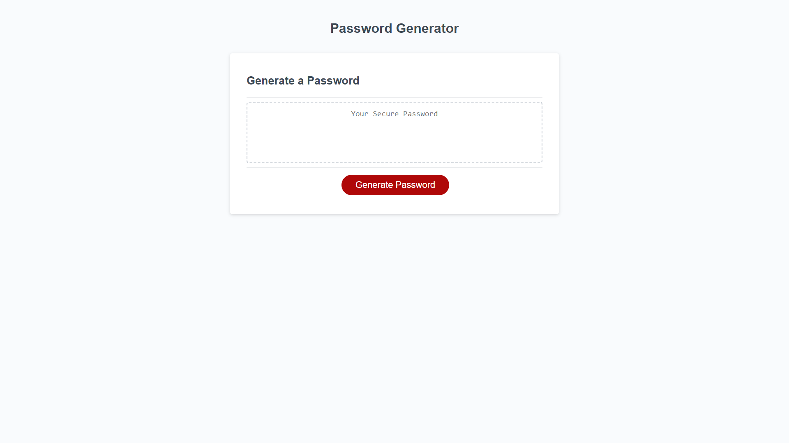

# Password Generator

## Description

This project was created to use Javascript to dynamically updated HTML and CSS. It takes in information from the user and changes the HTML depending on the input. It incorporates randomization depending on conditions given. I learned and practiced using arrays, functions and objects in JavaScript. 

## Installation

N/A. 

## Usage

Visit the website https://nicolasflamel.github.io/password-generator/ to see the working project. Click on the 'Generate Password' button which will generate prompts with instructions. Follow each prompt and once completed it will generate a random password in the middle box. 

## Credits

N/A

## License

N/A
